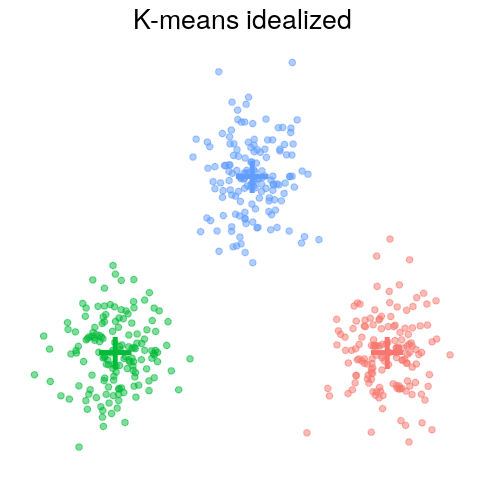
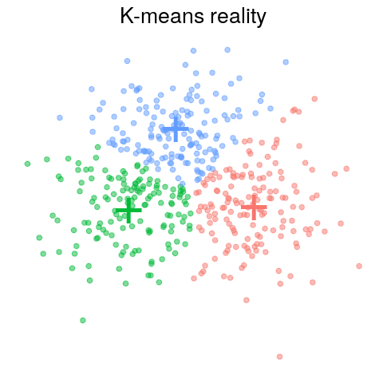

# Segmentation examples
Here we provide code accompanying our guide to psycho-behavioral segmentation for programs in global health (link to paper will be added when available). 

Figure 2 in the paper shows some simulated examples of k-means and hierarchical clustering, and attempts to illustrate how idealized data differs from a more realistic data set, to help researchers set expectations and evaluate solutions found. 

The code to generate these graphs can be found in the notebook [show_clustering_examples.ipynb](show_clustering_examples.ipynb) in this repository. The data simulation, clustering, and plotting is performed in the supporting script called [segmentation_helpers.R](segmentation_helpers.R). Feel free to copy the code to your own computer and play around by generating different shapes of data and seeing how the clustering algorithms perform.

In addition to what is in the paper, the notebook contains:

1. so-called "elbow plots" for the idealized and realistic data, helping analysts determine the appropriate number of clusters
1. Example of data where k-means fails, and how an alternative clustering algorithm (gaussian mixture model) can accurately cluster these data

In the future we might add additional examples and supporting code for the benefit of teams performing segmentation. 

## License
We encourage you to use the code for any purpose you like under the permissive [MIT License](http://mit-license.org). 
